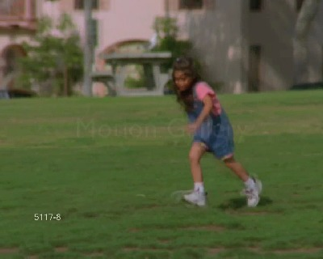
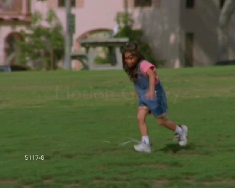
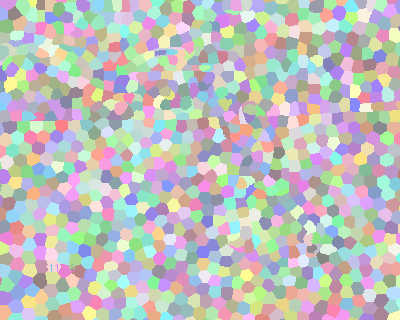
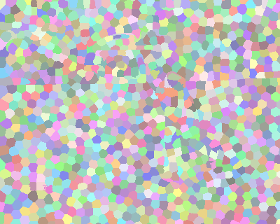

# TemporalSuperpixels
The C++ wrapper of the paper 'A Video Representation Using Temporal Superpixels'. The Matlab code should be found at http://people.csail.mit.edu/jchang7/code.php#TSP

## Dependences:
 - gsl

The GNU Scientific Librar (https://www.gnu.org/software/gsl/). The win64 version of the lib can be found in the directory `./3rdparty`. 

 - OpenCV

 The code is tested on OpenCV 2.4.11. Any version of OpenCV2+ should work.

## Notice
The code is tested on Visual Studio 2012 x64. When compiling, please add compile option `/D "GSL_DLL"`, or otherwise you may encounter a runtime error when dealing with the gsl functions.

## Result
Input 

Labels

